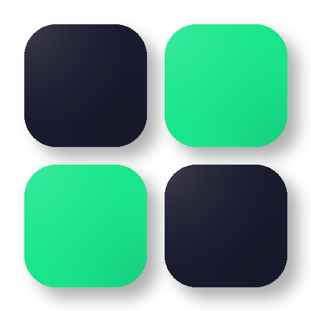
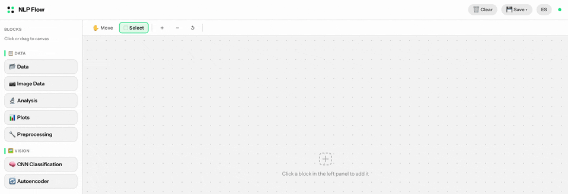

<div align="center">

<h1>
  <picture>
    <source media="(prefers-color-scheme: dark)" srcset="docs/assets/logo-dark-bg.png">
    
  </picture>
  &nbsp;NLP Flow
</h1>

[🇪🇸 Español](README.md) | 🇬🇧 English | [📖 Interactive docs](https://cdf51342.github.io/NLP-Flow/doc.html)

[](https://www.python.org/)
[](LICENSE)
[]()

A visual, node-based machine learning environment — no code required.



</div>

---

## What is it?

NLP Flow is an educational and research tool for exploring machine learning models visually. Designed for students, teachers, and researchers who want to experiment with data, NLP, computer vision, and RAG pipelines without programming.

**Use cases:**
- Teaching ML in the classroom without a coding environment
- Rapid prototyping of NLP or computer vision pipelines
- Exploratory analysis of tabular and text datasets
- Demonstrating concepts (Topic Models, Autoencoders, RAG)

---

## Project structure

```
NLP-flow/
├── main.py              # Launcher — Flask + native window (pywebview)
├── server.py            # Flask backend — ML routes, training, export
├── requirements.txt     # Python dependencies
├── .env                 # Environment variables (not included in repo)
├── static/
│   ├── index.html       # SPA frontend — canvas, blocks, modals
│   ├── icon-nlpflow.png # App icon
│   └── style.css        # Styles
└── docs/
    ├── index.html       # Documentation landing page
    ├── doc.html         # Interactive block documentation
    ├── pipelines.html   # Pipeline guide
    └── assets/          # Images, GIFs, and videos for documentation
```

---

## Installation

**Requirements:** Python 3.10 or higher.

```bash
git clone https://github.com/CDF51342/NLP-flow.git
cd NLP-flow
pip install -r requirements.txt
```

Create a `.env` file in the project root if you want to use the LLM (RAG) block:

```
GROQ_API_KEY=your_groq_key        # https://console.groq.com
HF_TOKEN=your_hf_token            # alternative: Hugging Face
```

Embeddings work without any key — they use `all-MiniLM-L6-v2` from Sentence Transformers.

---

## Usage

**Desktop mode** (native window):

```bash
python main.py
```

**Browser only** (no pywebview dependency):

```bash
python server.py
# Open http://localhost:5053
```

---

## Environment configuration

The **🤖 LLM (RAG)** block supports two providers. Create a `.env` file in the project root:

```
# Groq provider (default)
GROQ_API_KEY=your_groq_key
GROQ_MODEL=llama-3.1-8b-instant   # optional

# Hugging Face provider (alternative)
HF_TOKEN=your_hf_token
HF_LLM_MODEL=Qwen/Qwen2.5-7B-Instruct
```

---

## Saving and loading the canvas

- **💾 Save session (.zip)** — exports canvas + configuration + block state
- **📂 Load session (.zip)** — restores a saved canvas
- **🗺 Export canvas (.json)** — block structure and connections only

> Server-side data is not persisted between sessions. When restoring a canvas, reload the CSV in the Data block.

---

## License

Distributed under the [MIT](LICENSE) license © 2026 Carlos Díez-Fenoy.

The MIT license allows you to use, copy, modify, and distribute this software freely. The only requirement is to keep the original copyright notice in any copy or redistribution.

To cite this software in academic work, use the **"Cite this repository"** button on GitHub (via `CITATION.cff`) or the following BibTeX entry:

```bibtex
@software{diezfenoy2026nlpflow,
  author  = {Díez-Fenoy, Carlos},
  title   = {NLP Flow},
  year    = {2026},
  url     = {https://github.com/CDF51342/NLP-flow},
  license = {MIT}
}
```

---

## Credits

<p>
<strong>Carlos Díez-Fenoy</strong> &nbsp;
<a href="mailto:carlosdi@pa.uc3m.es"></a>
<a href="https://github.com/CDF51342"></a>
<a href="https://www.linkedin.com/in/carlos-diez-fenoy"></a>
<a href="https://orcid.org/0009-0008-5225-3575"></a>
</p>
